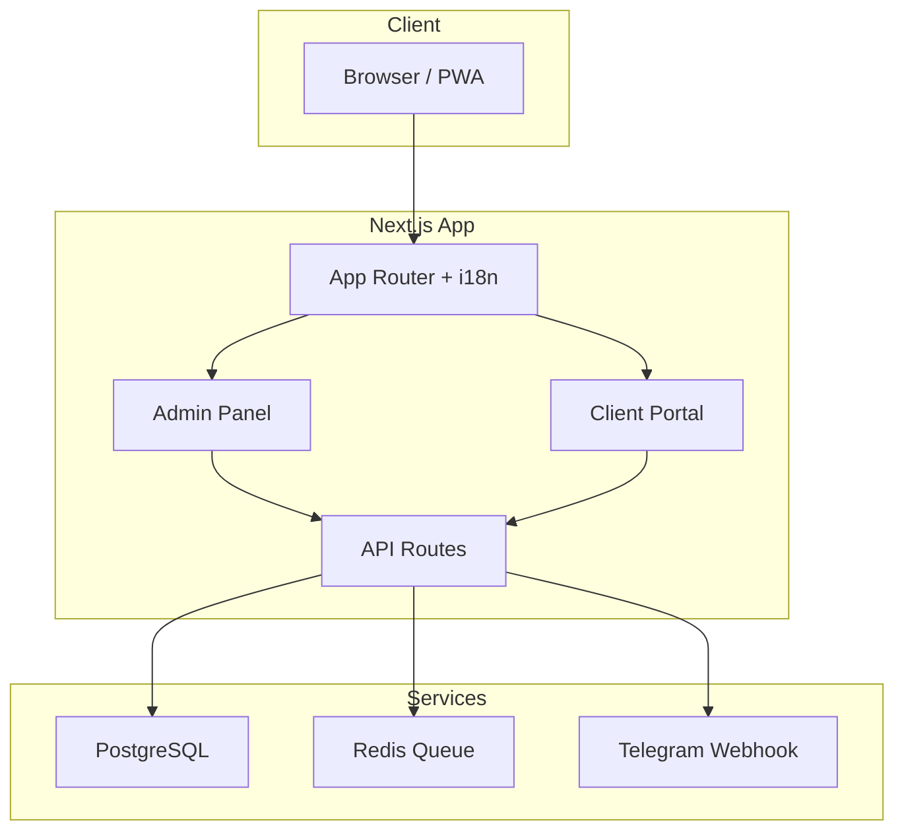

<div align="center">


# HatamiDev Portfolio & License Platform

**پرتفولیو حرفه‌ای + پلتفرم فروش و مدیریت لایسنس**

[](https://hatamidev.com)
[](https://github.com/HatamiDev)
[](#license)

[English](#english) · [فارسی](#فارسی)

</div>

---

## فارسی

> **توجه:** این ریپازیتوری یک **نمایشگاه عمومی (Showcase)** است. سورس کامل پروژه به‌صورت تجاری فروخته می‌شود و در اینجا منتشر **نشده** است.

### درباره پروژه

سایت [hatamidev.com](https://hatamidev.com) دو نقش هم‌زمان دارد:

1. **پرتفولیو شخصی** — معرفی مهارت‌ها، پروژه‌ها و تجربه‌های Mehran Hatami
2. **پلتفرم فروش لایسنس** — فروش، فعال‌سازی و مدیریت محصول Vendrix (پنل فروشگاهی)

### ویژگی‌های کلیدی

| ماژول | توضیح |
|---|---|
| 🌐 **چندزبانه** | فارسی، انگلیسی و آلمانی با `next-intl` |
| 🎬 **رابط سینمایی** | انیمیشن‌های Framer Motion و Anime.js |
| 🔐 **پورتال مشتری** | مدیریت لایسنس، دانلود محصول، پشتیبانی |
| 💳 **سیستم پرداخت** | PayPal، انتقال بانکی، کد تخفیف |
| 📜 **قرارداد دیجیتال** | امضای الکترونیکی نسخه‌بندی‌شده |
| 🔑 **مدیریت لایسنس** | امضای Ed25519، اعتبارسنجی آفلاین |
| 💬 **پشتیبانی تلگرام** | چت زنده با اتصال به تلگرام شخصی |
| 📊 **داشبورد ادمین** | آنالیتیکس، SEO، بلاگ، خبرنامه |
| 📱 **PWA** | قابل نصب روی موبایل |

### Tech Stack

```
Next.js 16  ·  React 19  ·  TypeScript  ·  Tailwind CSS 4
PostgreSQL  ·  Prisma 7  ·  NextAuth  ·  BullMQ  ·  Redis
Framer Motion  ·  Anime.js  ·  next-intl  ·  Zod
```

### معماری (خلاصه)



### اسکرین‌شات‌ها

> UI/UX طراحی و پیاده‌سازی شده — سورس کامل در ریپازیتوری عمومی موجود نیست.

| صفحه | لینk |
|---|---|
| صفحه اصلی | [hatamidev.com](https://hatamidev.com) |
| محصول Vendrix | [hatamidev.com/fa/products/panelfull](https://hatamidev.com/fa/products/panelfull) |
| قیمت‌گذاری | [hatamidev.com/fa/pricing](https://hatamidev.com/fa/pricing) |
| بلاگ | [hatamidev.com/fa/blog](https://hatamidev.com/fa/blog) |

### Build Status

✅ Production build verified — Next.js 16.2.10 (Webpack) — 195 routes compiled successfully.

---

## English

> **Note:** This repository is a **public showcase only**. The full source code is proprietary commercial software and is **not published** here.

### About

[hatamidev.com](https://hatamidev.com) serves dual purposes:

1. **Personal portfolio** — showcasing skills, projects, and experience
2. **License commerce platform** — selling, activating, and managing Vendrix (e-commerce panel) licenses

### Key Features

- **Trilingual** (FA / EN / DE) with SEO-optimized routing
- **Cinematic UI** with Framer Motion and Anime.js
- **Client portal** for license management, downloads, and support
- **Payment system** — PayPal, bank transfer, discount codes
- **Digital contracts** with versioned e-signatures
- **License management** — Ed25519 signed certificates, offline validation
- **Telegram-integrated support chat**
- **Admin dashboard** — analytics, SEO, blog, newsletter
- **PWA** — installable on mobile devices

### Tech Stack

Next.js 16 · React 19 · TypeScript · Tailwind CSS 4 · PostgreSQL · Prisma 7 · NextAuth · BullMQ · Redis

### Live Demo

🌐 **[hatamidev.com](https://hatamidev.com)**

---

## License

© 2024–2026 Mehran Hatami. All rights reserved.

This is proprietary software. No part of this project may be copied, modified, or distributed without explicit written permission from the author.

For licensing inquiries: [mehran873@gmail.com](mailto:mehran873@gmail.com) · [Telegram @hatamidev](https://t.me/hatamidev)

---

<div align="center">

**Built with ❤️ by [Mehran Hatami](https://hatamidev.com)**

[GitHub](https://github.com/HatamiDev) · [LinkedIn](https://www.linkedin.com/in/mehranhatami1) · [Instagram](https://www.instagram.com/mehranhatami_)

</div>
